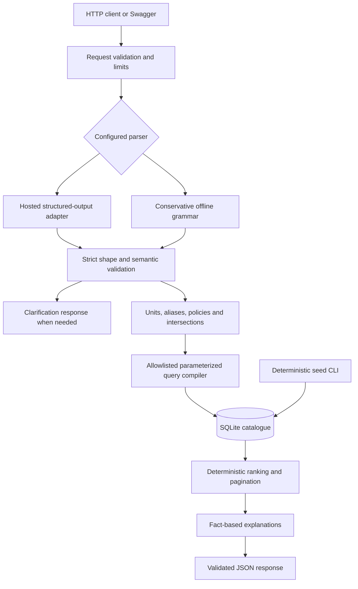

# AI Vehicle Search Engine Architecture

## Architecture decision

The implementation uses one Python backend process with a constrained intent parser, deterministic domain normalization, parameterized SQLite retrieval and code-generated explanations. The LLM translates language; catalogue records establish facts. The intended scope and behavior are authoritative in [SPEC.md](SPEC.md).

FastAPI's response models support validation and generated API schemas, and its testing interface integrates with pytest. These fit the assignment's API-documentation requirement without a custom UI.[^1][^2] SQLite is appropriate for a local, read-heavy demo with infrequent seeding; a shared write-heavy deployment would need a different storage choice.[^3] The selection is an engineering judgment about this assignment, not a universal stack recommendation.



## 1. Code ownership and dependency direction

The implemented package is deliberately compact:

```text
src/vehicle_search/
  api.py                   app factory, schemas, routes, limits and errors
  domain.py                listing, predicate, preference and JSON models
  normalization.py         quantities, enums, intersections and policies
  ranking.py               score formulas and Python reference ordering
  parsing/
    prompt.txt             versioned extraction prompt
  parsing.py               offline grammar and provider-output validation
  llm.py                   OpenRouter and Gemini HTTP adapters
  storage.py               constrained schema, compiler and read repository
  service.py               search orchestration, ranking and explanations
  seed.py                  CLI using curated templates
  evaluate.py              deterministic canonical/result evaluator
data/
  golden_queries.jsonl     36 labelled acceptance inputs
  heldout_queries.jsonl    24 labelled paraphrases
frontend/                  responsive test client served by the API
tests/                     unit, adapter, storage and API integration tests
```

Tests, Dockerfile, `pyproject.toml`, lock file, README and `.env.example` live at repository root and are part of the implemented MVP. The package is intentionally flat for this assignment; avoid generic agent frameworks, dependency injection containers, separate microservices or abstract repositories for databases not being implemented.

Routes depend on the search service; the service depends on parser and repository functions plus pure domain functions. Domain modules do not import HTTP or SQLite code. The app factory accepts a database path, while tests replace provider construction and use temporary databases.

## 2. Parser contracts

### Provider-neutral extraction object

Use a compact Pydantic model and derive the provider JSON schema. All object keys are required at the provider boundary, with empty arrays/sentinel enum values for absence; forbid extra fields. Avoid recursive generic ASTs and arbitrary free text execution.

```json
{
  "intent":"search",
  "predicates":[
    {"field":"price_inr","op":"lt","values":["₹15L"],"evidence":"under ₹15L"},
    {"field":"body_type","op":"in","values":["SUVs"],"evidence":"SUVs"}
  ],
  "preferences":[],
  "sort":"unspecified",
  "sort_evidence":"",
  "issues":[],
  "policy_terms":[]
}
```

- `intent`: `search|clarify|out_of_scope`.
- `predicates`: maximum 16 items. Each has an allowlisted field/operator from SPEC, 1–8 raw string values (<= 80 chars each), and an exact query substring `evidence` (<= 200 chars).
- `preferences`: unique array of objects `{code, evidence}`, codes from SPEC; maximum 4.
- `sort`: `unspecified` or one supported sort. `sort_evidence` is a required string, empty only for unspecified; otherwise an exact query substring supporting the sort. Validate it before applying any API-body override.
- `issues`: maximum 8 `{code, evidence}` objects; code `ambiguous|contradictory|unsupported|unverifiable`.
- `policy_terms`: unique objects `{code, evidence}` with code `family|high_safety|five_star_safety`; application code expands policies, not the LLM. Maximum 3.

Raw numeric values remain text so application code converts lakh/crore/k exactly. Numeric predicates have exactly one value; categorical predicates use raw aliases; “between” creates gte/lte atoms. Model output cannot supply scores, cars, recommendations, SQL, field paths, URLs to fetch or new policies.

The canonical internal predicate has `{field, op, values, source, evidence}`. Numeric values are strict integers; categorical values are canonical strings. `source` is `explicit|policy`, assigned by code. Empty predicate lists are permitted only for recognized browse queries or a query with supported preferences.

### Validation order

1. Check provider termination, output presence and JSON validity; never accept a truncated prefix or strip arbitrary prose to rescue an invalid response.
2. Strictly validate original application schema after any SDK schema transformation. Pydantic strict validation reduces accidental type coercion; it does not establish meaning.[^4]
3. Verify each evidence string is a nonempty exact substring of the original query. Match aliases case-insensitively inside evidence. This is supporting provenance, not proof of correct interpretation.
4. Parse each numeric literal using a deterministic unit parser. Confirm number, unit, field context and comparison in its evidence; validate bound direction. Do not accept a model-computed `1500000` where the text actually says `15L` unless the raw literal is retained for verification.
5. Independently scan supported numeric/negation phrases in the original query; require all recognized constraints to be represented consistently. Keep this scanner scoped to the documented grammar. Disagreement requires clarification; do not silently choose whichever parse is convenient.
6. Enforce field/operator/value type compatibility, limits, enum aliases, policy terms and contradictory intersections. Multiple atoms can cite the same compound phrase.
7. Map issues and material unsupported criteria to safe clarification templates. Numeric claims not deterministically verifiable require clarification. Do not invent numeric thresholds from adjectives.
8. Expand policy terms, normalize and deduplicate equivalent atoms, assign effective sort and generate assumption text in code. Evidence for policy predicates cites the policy phrase.

The scanner cannot prove that every possible English constraint was preserved. The extraction prompt must identify unsupported requirements, and held-out/adversarial evaluation measures remaining semantic errors. Never describe schema-constrained parsing as a complete prompt-injection defense.

### Hosted adapters

Implement provider adapters behind `parse(query, vocabulary) -> RawIntent`. OpenRouter is the default route because its OpenAI-compatible chat endpoint can target free/low-cost models and supports JSON Schema `response_format` with strict mode and response healing.[^5a][^5b] Gemini direct is the second route using `generateContent`, `responseMimeType: application/json` and `responseSchema`; the configured default is Gemini 3.8 Flash, whose official model page lists structured outputs.[^5c] Validate every response against the original application schema. Verify the exact model slug and account availability before a live run; a model appearing in public docs does not guarantee a user's quota or free routing.

Configuration: `PARSER_MODE`, `LLM_PROVIDER=openrouter|gemini`, `LLM_MODEL`, `OPENROUTER_API_KEY`, `GEMINI_API_KEY`, `LLM_TIMEOUT_SECONDS=10`, `LLM_MAX_OUTPUT_TOKENS=1600`, `ALLOW_OFFLINE_FALLBACK=false`, `DATABASE_PATH=./data/catalogue.db`, `LOG_LEVEL=INFO`. Fail readiness when LLM mode lacks the selected provider key or model. Offline mode should not instantiate a provider client. Do not require a paid call on startup or health checks.

Use one bounded direct HTTP call with SDK retries absent. OpenRouter fallback models share one overall monotonic deadline. Each API request creates and closes its own read-only SQLite connection. A single-worker local runtime is sufficient for the demonstrated deployment. Instrument parsing and retrieval separately.

### Offline grammar

Support conjunctions of the documented numeric comparisons, known field aliases, known names/cities, family/safety policies and sort phrases. First recognize full phrases, then require every remaining meaningful token to belong to an explicit filler list. Unsupported residual words produce clarification. This permits paraphrases built from the grammar without pretending to understand arbitrary text. Test against hardcoded-string implementations by varying word order, units, quantities and case.

## 3. Storage and query compilation

Use standard-library `sqlite3`, avoiding an ORM for this limited read API. Initialize schema explicitly through the seed CLI. API startup verifies schema version and nonempty seed metadata; it must not silently create a missing catalogue. Open request connections read-only via a SQLite URI with `mode=ro`; seeding owns a separate write connection. Do not run seed while the service is running.

Tables:

- `vehicles`: required listing fields, normalized make/model/city keys, dedicated safety columns and synthetic flags. CHECK constraints enforce enums, nonnegative values and star ranges. ID primary key.
- `vehicle_features(vehicle_id, feature)`: composite primary key, FK to vehicle, constrained feature code. Enable foreign keys on write connections.
- `catalogue_metadata`: a single versioned dataset record.

No descriptions are sent to the LLM or used as executable instructions. Use bound parameters for values; Python's sqlite3 documentation explicitly recommends placeholders instead of assembling values into SQL.[^6] Whitelist column and operator mappings in source code because identifiers and sort fragments cannot be supplied as ordinary value parameters. `in/not_in` uses bounded generated placeholder counts. Feature predicates compile to one EXISTS per required feature. Reject empty value lists before SQL generation.

Use SQL WHERE for all hard predicates, including null-aware safety comparisons. Compute the documented global sort expression in SQLite, then page; count exact matches using the same WHERE clause. Hydrate features for the selected page with a bounded bulk query, not N+1 queries. Tests compare SQL ordering against the full-candidate Python reference for every preference and explicit sort mode.

Initial indexes: `(body_type, price_inr)`, `(fuel_type, transmission, odometer_km)`, `(city_key, price_inr)`, `(make_key, model_key)`, and feature `(feature, vehicle_id)`. Verify useful indexes with representative `EXPLAIN QUERY PLAN`; do not claim every query is index-only. No index is necessary for each possible filter combination at this scale.

## 4. Deterministic ranking

Compute components in [0,1] from stored facts:

- `family`: `0.50 * min(seats / 7, 1) + 0.25 * has_isofix + 0.25 * has_rear_ac`.
- `safety`: `(adult_stars_or_zero + child_stars_or_zero) / 10`. Zero contribution for missing is a ranking convention only; preserve null in data.
- `affordability`: `1 - min(price_inr / 5_000_000, 1)`.
- `low_odometer`: `1 - min(odometer_km / 200_000, 1)`.

Score = arithmetic mean of requested components, or 0 if none. Use full precision to order and round the displayed score to four decimals. Constants are transparent demo heuristics, not empirical suitability measures. They do not depend on which other results happen to be on the page. Explicit sort fields are nonnullable. Tie on ID ascending. Default relevance also uses price ascending before ID.

Generate one reason per applied hard predicate plus concise explanations of requested preferences. Numeric reasons contain actual values and exact comparator. Policy reasons state the policy, e.g. “5 seats meets the demo family minimum of 5.” Safety reasons always say synthetic/demo when applicable. Never use an LLM to embellish reasons or infer accident history, reliability, real-world safety or ownership costs.

## 5. Seed generation and reproducibility

The builder creates curated fictional variant templates specifying allowed fuel/transmission/seat combinations and segment price ranges. Sample listing year, price, distance and city conditionally, with a local seeded PRNG and fixed reference date `2026-01-01`. Do not sample each field independently: an electric/manual combination or new listing with 80,000 km is invalid. Used prices/odometer should vary plausibly by age but need not model a real market.

Reserve the first eight IDs for the exact acceptance anchors in EVALUATION. Append generated records to reach `--count` total; reject counts < 8. Suggested CLI contract: `python -m vehicle_search.seed --count 300 --seed 42`. Same input/version must produce identical logical records and data hash; SQLite file bytes need not be identical. Seed into a transaction, validate every row, then commit metadata atomically. Rerunning against matching metadata is a no-op; mismatched existing data requires explicit `--reset`. Reset affects only the configured demo database and is documented as destructive to that file.

Default generated data target: all four body types, all five fuel families, both transmission families, multiple seat counts and cities; >10% unknown adult or child ratings; examples with exactly 1,500,000 INR and exactly 80,000 km; unrated and 0-star are separate cases. Include `is_synthetic` everywhere and a README data disclaimer.

## 6. Security, reliability and operations

The main boundaries are untrusted query to parser, untrusted parser output to normalizer, and canonical predicates to query compiler. OWASP recommends structured separation, output validation and least privilege; those inform the architecture here.[^7] Prompts alone are insufficient.

No runtime tools, shell, browsing, database writes, arbitrary SQL, user-defined SDK base URLs or external document retrieval. Error logs include request ID, error category, parser mode, prompt/schema version, duration and provider token usage if available. Raw queries and model output are not logged by default. Keys belong only in environment variables. Exclude `.env`, generated databases, caches and raw live logs from git; commit safe samples only.

A local Dockerfile runs a nonroot user and a single service. Provide a volume/path for generated data and a documented seed command before API startup. No database server or Compose stack is needed. Bind the local quickstart to localhost; explain that public API hosting is a separate deployment decision. An evaluation script sends sequential live requests by default to bound spending and reports token counts without inventing current prices.

## 7. Alternatives and evolution

| Option | Why not MVP | Trigger to reconsider |
|---|---|---|
| Regex-only natural-language search | Too narrow as the only AI capability | Retain only as transparent offline mode |
| Free-form text-to-SQL | Broad executable output surface; harder contract | No need for this assignment |
| Vector-only retrieval | Similarity does not encode strict numeric validity | Never replace hard filters |
| SQLite FTS5 | Useful lexical search, but core fields are structured | Measured unmet description-search queries |
| PostgreSQL + pgvector hybrid | Additional services, migrations and relevance tuning | Larger catalogue with demonstrated semantic retrieval need |
| LLM reranking / answer synthesis | More cost and potential unsupported claims | Demonstrated evaluation gain with grounded outputs |
| LangChain / agent orchestration | No multi-step autonomous workflow here | A later workflow that needs those abstractions |

SQLite documents FTS5 as full-text search.[^8] pgvector supports vector retrieval, but approximate-index filtering can yield fewer matches and needs explicit tuning.[^9] These capabilities are useful later; the present recommendation is based on scope and failure modes, not a head-to-head benchmark. Move to PostgreSQL when multiple application instances need shared transactional writes; retain parser and domain interfaces. Add embeddings only after building a labelled dataset of queries the structured approach cannot adequately serve.

## Sources

[^1]: FastAPI, [Response Model – Return Type](https://fastapi.tiangolo.com/tutorial/response-model/), undated, accessed 2026-09-10.
[^2]: FastAPI, [Testing](https://fastapi.tiangolo.com/tutorial/testing/), undated, accessed 2026-09-10.
[^3]: SQLite, [Appropriate Uses for SQLite](https://www.sqlite.org/whentouse.html), page updated 2025-05-31, accessed 2026-09-10.
[^4]: Pydantic, [Strict Mode](https://docs.pydantic.dev/latest/concepts/strict_mode/), rolling documentation, accessed 2026-09-10.
[^5a]: OpenRouter, [Structured Outputs](https://openrouter.ai/docs/guides/features/structured-outputs), rolling documentation, accessed 2026-09-10.
[^5b]: OpenRouter, [Chat Completions API](https://openrouter.ai/docs/api/api-reference/chat/send-chat-completion-request), rolling documentation, accessed 2026-09-10.
[^5c]: Google, [Gemini 3.8 Flash model](https://ai.google.dev/gemini-api/docs/models/gemini-3.8-flash), rolling documentation, accessed 2026-09-10.
[^6]: Python Software Foundation, [sqlite3](https://docs.python.org/3/library/sqlite3.html), rolling documentation, accessed 2026-09-10.
[^7]: OWASP, [LLM Prompt Injection Prevention Cheat Sheet](https://cheatsheetseries.owasp.org/cheatsheets/LLM_Prompt_Injection_Prevention_Cheat_Sheet.html), undated, accessed 2026-09-10.
[^8]: SQLite, [FTS5 Extension](https://www.sqlite.org/fts5.html), rolling documentation, accessed 2026-09-10.
[^9]: pgvector maintainers, [pgvector README: Filtering](https://github.com/pgvector/pgvector#filtering), rolling documentation, accessed 2026-09-10.
